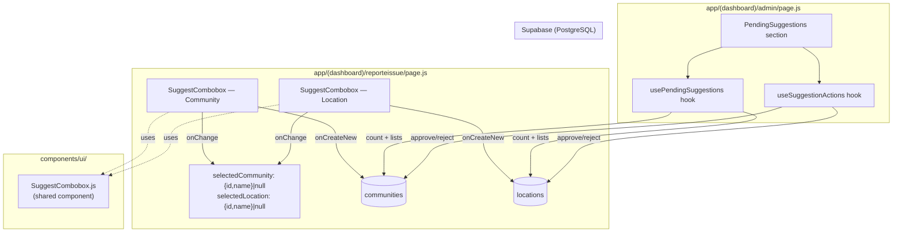

# Design Document — community-location-suggest-create

## Overview

This feature replaces the static `SelectInput` dropdowns for community and location in the `ReportForm` (`app/(dashboard)/reporteissue/page.js`) with a reusable `SuggestCombobox` component that supports live search and inline record creation. When a reporter cannot find their community or location in the existing list, they can add it directly from the form. New entries are inserted into the database immediately (so the report can be submitted) and flagged for admin review. Admins can approve or reject these suggestions from a new "Pending Suggestions" section in the admin panel.

The design introduces:
- One new reusable UI component: `SuggestCombobox`
- Two new hooks: `usePendingSuggestions` and `useSuggestionActions`
- One database migration: adds `is_user_suggested` to `communities`
- Targeted changes to `ReportForm` state shape and submit logic
- A new section in the admin panel page

---

## Architecture



### Key Design Decisions

**Single reusable component for both fields.** Community and location comboboxes share identical UX patterns (live search, "Add new" option, inline form, loading/disabled states). Parameterising the differences via props (`createFields`, `onCreateNew`, `entityLabel`) avoids duplicating ~200 lines of UI logic.

**State shape change in ReportForm.** `form.community` (string name) and `form.location` (string name) are replaced with `selectedCommunity: {id, name} | null` and `selectedLocation: {id, name} | null` held outside the `form` object. This eliminates the fragile name→id lookup at submit time and makes the selected value unambiguous. All other `form` fields are unchanged.

**Immediate insert, flag for review.** New entries are written to the database before the report is submitted. This keeps the submit flow simple (community_id and location_id are always real FK values) and avoids a two-phase commit. The `is_user_suggested` / `status='pending_review'` flags gate admin review without blocking the reporter.

**Hooks follow existing TanStack Query pattern.** `usePendingSuggestions` and `useSuggestionActions` mirror the pattern established by `useUserManagement` — `useQuery` for reads, `useMutation` with optimistic updates for writes.

---

## Components and Interfaces

### `SuggestCombobox` (`components/ui/SuggestCombobox.js`)

A controlled combobox that wraps a text input, a dropdown list, and an optional inline create form.

#### Props

| Prop | Type | Required | Description |
|---|---|---|---|
| `items` | `Array<{id: string, name: string}>` | yes | Current list of selectable items |
| `value` | `{id: string, name: string} \| null` | yes | Currently selected item |
| `onChange` | `(item: {id, name} \| null) => void` | yes | Called when selection changes or is cleared |
| `onSearch` | `(query: string) => void` | yes | Called as the user types; used for server-side filtering |
| `loading` | `boolean` | yes | When true, input is disabled and shows loading placeholder |
| `disabled` | `boolean` | yes | When true, input is disabled (e.g. no community selected yet) |
| `placeholder` | `string` | yes | Placeholder text shown in the input |
| `onCreateNew` | `(name: string, extraFields: object) => Promise<{id, name}>` | yes | Called when user confirms the inline create form |
| `createFields` | `Array<{key: string, label: string, placeholder?: string}>` | yes | Extra fields rendered in the inline create form |
| `entityLabel` | `string` | yes | Entity name used in the "Add [name] as new [entityLabel]" prompt |

#### Internal State

```
inputValue: string          — text currently in the input
isOpen: boolean             — dropdown visibility
showInlineForm: boolean     — inline create form visibility
inlineFields: object        — keyed by createFields[].key, holds current values
creating: boolean           — true while onCreateNew Promise is pending
```

#### Behaviour Contract

- The dropdown opens when the input receives focus and `inputValue` is non-empty, or when the user types.
- Items are filtered client-side: `item.name.toLowerCase().includes(inputValue.toLowerCase())`.
- When filtered results are empty and `inputValue.trim()` is non-empty, an "Add '[inputValue]' as new [entityLabel]" option is appended to the dropdown.
- Selecting a real item calls `onChange({id, name})` and closes the dropdown.
- Selecting the "Add new" option hides the dropdown and shows the inline form.
- Confirming the inline form calls `onCreateNew(inputValue, inlineFields)`. On success, calls `onChange` with the returned `{id, name}` and closes the form. On failure, keeps the form open.
- Cancelling the inline form clears `inputValue` and hides the form.
- Clearing the input (backspace to empty) calls `onChange(null)`.
- While `loading` is true, the input is `disabled` and shows the `placeholder` text.
- Clicking outside the dropdown closes it (uses `useOutsideClick` hook already in the project).

#### Accessibility

- Input has `role="combobox"`, `aria-expanded`, `aria-autocomplete="list"`.
- Dropdown list has `role="listbox"`; each option has `role="option"`.
- "Add new" option is keyboard-navigable (arrow keys, Enter to select).
- Inline form fields have associated `<label>` elements.

---

### `ReportForm` state changes (`app/(dashboard)/reporteissue/page.js`)

Replace:
```js
// Before
const [form, setForm] = useState({
  ...
  community: "",   // string name
  location:  "",   // string name
  ...
});
```

With:
```js
// After — community and location live outside form
const [selectedCommunity, setSelectedCommunity] = useState(null); // {id, name} | null
const [selectedLocation,  setSelectedLocation]  = useState(null); // {id, name} | null

const [form, setForm] = useState({
  issueType:        "",
  severity:         "",
  description:      "",
  healthRisk:       false,
  affectedCount:    "",
  affectedChildren: "",
  locationType:     "",
  phone:            "",
  isAnonymous:      false,
});
```

Submit validation changes:
- `if (!form.community)` → `if (!selectedCommunity)`
- `communityId` is `selectedCommunity.id` (no lookup needed)
- `locationId` is `selectedLocation?.id ?? null` (no lookup needed)

Community combobox wiring:
```js
<SuggestCombobox
  items={communities}
  value={selectedCommunity}
  onChange={(item) => {
    setSelectedCommunity(item);
    setSelectedLocation(null);   // clear location on community change
  }}
  onSearch={setCommunityQuery}
  loading={communitiesLoading}
  disabled={false}
  placeholder={communitiesLoading ? "Loading communities…" : "Select community…"}
  entityLabel="community"
  createFields={[
    { key: "district", label: "District", placeholder: "e.g. Tamale Central" },
    { key: "region",   label: "Region",   placeholder: "e.g. Northern Region" },
  ]}
  onCreateNew={async (name, { district, region }) => {
    const { data, error } = await supabase
      .from("communities")
      .insert({ name, district: district || null, region: region || null, is_user_suggested: true })
      .select("id, name")
      .single();
    if (error) throw error;
    return data;
  }}
/>
```

Location combobox wiring:
```js
<SuggestCombobox
  items={locations}
  value={selectedLocation}
  onChange={setSelectedLocation}
  onSearch={setLocationQuery}
  loading={locationsLoading}
  disabled={!selectedCommunity}
  placeholder={
    locationsLoading    ? "Loading locations…"    :
    !selectedCommunity  ? "Select community first" :
                          "Select location…"
  }
  entityLabel="location"
  createFields={[
    { key: "area_name", label: "Area name", placeholder: "e.g. Central Market" },
    { key: "landmark",  label: "Landmark",  placeholder: "e.g. Near the mosque" },
  ]}
  onCreateNew={async (name, { area_name, landmark }) => {
    if (!form.locationType) {
      toast.error("Please select a location type first");
      throw new Error("location_type_required");
    }
    const { data, error } = await supabase
      .from("locations")
      .insert({
        name,
        community_id: selectedCommunity.id,
        type:         form.locationType,
        area_name:    area_name  || null,
        landmark:     landmark   || null,
        latitude:     geoData?.lat  ?? 0,
        longitude:    geoData?.lng  ?? 0,
        status:       "pending_review",
        created_by:   profile.id,
      })
      .select("id, name")
      .single();
    if (error) throw error;
    return data;
  }}
/>
```

---

### `usePendingSuggestions` (`hooks/usePendingSuggestions.js`)

```js
// Returns
{
  pendingCommunities: Array<Community>,  // is_user_suggested = true
  pendingLocations:   Array<Location>,   // status = 'pending_review', joined with community name
  totalCount:         number,            // pendingCommunities.length + pendingLocations.length
  loading:            boolean,
}
```

Queries:
- `communities` where `is_user_suggested = true`, select `id, name, district, region, created_at`
- `locations` where `status = 'pending_review'`, select `id, name, type, area_name, landmark, created_by, created_at, community:communities(name)`

Both queries run in parallel via `Promise.all`. Uses `useQuery` with a dedicated query key (e.g. `["pending-suggestions"]`).

---

### `useSuggestionActions` (`hooks/useSuggestionActions.js`)

```js
// Returns
{
  approveCommunity: (id: string) => void,
  rejectCommunity:  (id: string) => void,
  approveLocation:  (id: string) => void,
  rejectLocation:   (id: string) => void,
}
```

Each action is a `useMutation` with optimistic update:
- `approveCommunity(id)`: `UPDATE communities SET is_user_suggested = false WHERE id = id`
- `rejectCommunity(id)`: `DELETE FROM communities WHERE id = id`
- `approveLocation(id)`: `UPDATE locations SET status = 'operational' WHERE id = id`
- `rejectLocation(id)`: `DELETE FROM locations WHERE id = id`

Optimistic update: remove the item from the pending list immediately. On error, roll back and show `toast.error`. On success, show `toast.success` and invalidate `["pending-suggestions"]`.

---

### Admin Panel additions (`app/(dashboard)/admin/page.js`)

A new "Pending Suggestions" section is added below the existing User Management section. It is only rendered when the user has admin permissions (same guard as the existing section).

```
┌─────────────────────────────────────────────────────┐
│  Pending Suggestions          [badge: 3]            │
├─────────────────────────────────────────────────────┤
│  Communities (2)                                    │
│  ┌──────────────────────────────────────────────┐  │
│  │ Kpong Farms  │ Tamale Central │ Northern  │ … │  │
│  │              [Approve]  [Reject]             │  │
│  └──────────────────────────────────────────────┘  │
│  Locations (1)                                      │
│  ┌──────────────────────────────────────────────┐  │
│  │ Market Drain │ Public toilet │ Kpong Farms   │  │
│  │              [Approve]  [Reject]             │  │
│  └──────────────────────────────────────────────┘  │
└─────────────────────────────────────────────────────┘
```

---

## Data Models

### `communities` table (after migration)

| Column | Type | Notes |
|---|---|---|
| `id` | `uuid` | PK |
| `name` | `text` | |
| `district` | `text` | nullable |
| `region` | `text` | nullable |
| `is_user_suggested` | `boolean` | **NEW** — DEFAULT false |
| `created_at` | `timestamptz` | |

Migration file: `supabase/migrations/add_is_user_suggested_to_communities.sql`

```sql
ALTER TABLE communities
  ADD COLUMN IF NOT EXISTS is_user_suggested boolean NOT NULL DEFAULT false;
```

### `locations` table (existing, relevant columns)

| Column | Type | Notes |
|---|---|---|
| `id` | `uuid` | PK |
| `name` | `text` | |
| `type` | `text` | e.g. "Public toilet" |
| `community_id` | `uuid` | FK → communities.id |
| `area_name` | `text` | nullable |
| `landmark` | `text` | nullable |
| `latitude` | `float8` | defaults to 0 if GPS not captured |
| `longitude` | `float8` | defaults to 0 if GPS not captured |
| `status` | `text` | `'pending_review'` for user-suggested; `'operational'` after approval |
| `created_by` | `uuid` | FK → profiles.id |
| `created_at` | `timestamptz` | |

### `SuggestCombobox` internal value shape

```js
// Item shape (shared between communities and locations)
{
  id:   string,   // UUID from database
  name: string,   // Display name
}
```

### `ReportForm` state shape (after change)

```js
selectedCommunity: { id: string, name: string } | null
selectedLocation:  { id: string, name: string } | null

form: {
  issueType:        string,
  severity:         string,
  description:      string,
  healthRisk:       boolean,
  affectedCount:    string,
  affectedChildren: string,
  locationType:     string,
  phone:            string,
  isAnonymous:      boolean,
}
```

---

## Correctness Properties

*A property is a characteristic or behavior that should hold true across all valid executions of a system — essentially, a formal statement about what the system should do. Properties serve as the bridge between human-readable specifications and machine-verifiable correctness guarantees.*

### Property 1: Combobox filtering is case-insensitive and exact

*For any* list of items and any query string, the items returned by the combobox filter function shall be exactly those items whose `name` contains the query string (case-insensitive) — no more, no fewer.

**Validates: Requirements 2.2, 4.3**

---

### Property 2: "Add new" option appears if and only if no items match

*For any* list of items and any non-empty query string, the "Add new" option is displayed if and only if the filtered result set is empty.

**Validates: Requirements 3.1, 5.1**

---

### Property 3: Selecting any item calls onChange with that item's exact id and name

*For any* item in the dropdown list, selecting it shall call `onChange` with an object whose `id` and `name` are identical to that item's `id` and `name`.

**Validates: Requirements 2.5**

---

### Property 4: Community insert payload always includes `is_user_suggested = true`

*For any* combination of `name`, `district`, and `region` values (including empty strings), calling the community `onCreateNew` handler shall invoke the Supabase insert with `is_user_suggested: true`, `name` set to the typed name, and `district`/`region` set to `null` when the input was blank.

**Validates: Requirements 3.3**

---

### Property 5: Location insert payload always includes `status = 'pending_review'` and `created_by = profile.id`

*For any* combination of `name`, `area_name`, `landmark`, and `geoData` values (including null geoData), calling the location `onCreateNew` handler shall invoke the Supabase insert with `status: 'pending_review'` and `created_by` equal to the authenticated profile's id.

**Validates: Requirements 5.3**

---

### Property 6: Location creation is blocked when `locationType` is empty

*For any* location name and any extra fields, calling the location `onCreateNew` handler when `form.locationType` is an empty string shall never invoke the Supabase insert and shall always show a validation toast.

**Validates: Requirements 5.7**

---

### Property 7: Submit payload uses selected community and location ids directly

*For any* `selectedCommunity: {id, name}` and `selectedLocation: {id, name}` pair, the `sanitation_reports` insert payload shall contain `community_id = selectedCommunity.id` and `location_id = selectedLocation.id`.

**Validates: Requirements 6.2**

---

### Property 8: Pending badge count equals sum of pending communities and locations

*For any* count of pending communities `c` and pending locations `l`, the badge displayed in the admin panel shall show exactly `c + l`.

**Validates: Requirements 7.1, 7.2**

---

### Property 9: Approve community sets `is_user_suggested = false`; approve location sets `status = 'operational'`

*For any* community id in the pending list, calling `approveCommunity(id)` shall invoke `UPDATE communities SET is_user_suggested = false WHERE id = id`. *For any* location id in the pending list, calling `approveLocation(id)` shall invoke `UPDATE locations SET status = 'operational' WHERE id = id`.

**Validates: Requirements 8.2, 9.2**

---

### Property 10: Reject removes the item from the pending list

*For any* pending community or location, after a successful reject action, that item shall no longer appear in the pending list and the badge count shall decrease by one.

**Validates: Requirements 8.3, 8.5, 9.3, 9.4**

---

### Property 11: Pending list rows contain all required display fields

*For any* list of suggested communities, each rendered row shall contain the community's `name`, `district`, `region`, and creation date. *For any* list of suggested locations, each rendered row shall contain the location's `name`, `type`, `area_name`, `landmark`, parent community name, and `created_by` identifier.

**Validates: Requirements 8.1, 9.1**

---

## Error Handling

### `SuggestCombobox` — `onCreateNew` failure

When `onCreateNew` rejects (Supabase error or validation error), the component:
1. Sets `creating = false`
2. Keeps `showInlineForm = true` so the user can retry
3. Does **not** call `onChange`

The caller (ReportForm) is responsible for showing the toast inside `onCreateNew` before throwing, so the combobox itself does not need to know the error message.

Exception: the `location_type_required` error is thrown by the location `onCreateNew` after showing a toast. The combobox treats any thrown error identically — keep the form open.

### `SuggestCombobox` — network/loading states

- If `onSearch` triggers a fetch that fails, the parent hook is responsible for showing a toast. The combobox simply renders whatever `items` it receives (empty list → "Add new" option appears).
- The `loading` prop gates the disabled state; the parent controls when to set it.

### `usePendingSuggestions` — fetch failure

Uses TanStack Query's built-in error state. The admin panel renders an error message in place of the pending list. The badge shows `—` (dash) while in error state.

### `useSuggestionActions` — mutation failure

Optimistic update is rolled back. `toast.error` is shown. The item reappears in the pending list. The admin can retry.

### Community rejection with associated locations

Before calling `rejectCommunity`, the admin panel checks whether the community has any associated location rows (queried from the already-loaded `pendingLocations` list, plus a count query for non-pending locations). If associated locations exist, a confirmation dialog is shown. The delete proceeds only after confirmation. The Supabase delete relies on the database's `ON DELETE CASCADE` or the admin panel performs a two-step delete (locations first, then community) — the exact strategy depends on the FK constraint definition, which should be verified during implementation.

### `locationType` guard in location `onCreateNew`

```js
if (!form.locationType) {
  toast.error("Please select a location type before adding a new location");
  throw new Error("location_type_required");
}
```

This is a synchronous guard before the async Supabase call, so no partial state is written.

---

## Testing Strategy

The project uses **Vitest** with **@testing-library/react** and **jsdom** (confirmed in `package.json`). No property-based testing library is currently installed; **fast-check** is the recommended addition for this feature.

```bash
npm install --save-dev fast-check@3
```

### Dual Testing Approach

**Unit / example tests** cover specific interactions, loading states, error paths, and UI structure. **Property tests** verify universal invariants across generated inputs.

### Property Tests (fast-check, minimum 100 runs each)

Each property test is tagged with a comment referencing the design property.

```
// Feature: community-location-suggest-create, Property 1: Combobox filtering is case-insensitive and exact
// Feature: community-location-suggest-create, Property 2: "Add new" option appears iff no items match
// Feature: community-location-suggest-create, Property 3: Selecting any item calls onChange with exact id and name
// Feature: community-location-suggest-create, Property 4: Community insert payload always includes is_user_suggested=true
// Feature: community-location-suggest-create, Property 5: Location insert payload always includes status=pending_review and created_by
// Feature: community-location-suggest-create, Property 6: Location creation blocked when locationType is empty
// Feature: community-location-suggest-create, Property 7: Submit payload uses selected community and location ids directly
// Feature: community-location-suggest-create, Property 8: Pending badge count equals sum of pending communities and locations
// Feature: community-location-suggest-create, Property 9: Approve sets correct field values
// Feature: community-location-suggest-create, Property 10: Reject removes item from pending list
// Feature: community-location-suggest-create, Property 11: Pending list rows contain all required display fields
```

**Property 1 — filtering function** (`SuggestCombobox.filterItems`):
- Arbitraries: `fc.array(fc.record({id: fc.uuid(), name: fc.string()}))`, `fc.string()`
- Assert: `result.every(item => item.name.toLowerCase().includes(query.toLowerCase()))` and `items.filter(i => i.name.toLowerCase().includes(query.toLowerCase())).length === result.length`

**Property 2 — "Add new" visibility**:
- Arbitraries: same item array + non-empty query string
- Assert: `showAddNew === (filteredItems.length === 0)`

**Property 3 — onChange payload**:
- Arbitraries: `fc.array(fc.record({id: fc.uuid(), name: fc.string()}), {minLength: 1})`
- Pick a random index, simulate click, assert `onChange` called with `{id: items[i].id, name: items[i].name}`

**Property 4 — community insert payload**:
- Arbitraries: `fc.string()` for name, `fc.option(fc.string())` for district/region
- Mock Supabase insert, call `onCreateNew`, assert payload has `is_user_suggested: true` and null coercion for blank strings

**Property 5 — location insert payload**:
- Arbitraries: `fc.string()` for name, `fc.option(fc.record({lat: fc.float(), lng: fc.float()}))` for geoData
- Mock Supabase insert, assert `status: 'pending_review'` and `created_by: profile.id` always present

**Property 6 — locationType guard**:
- Arbitraries: `fc.string()` for name, any extra fields
- Set `locationType = ""`, call `onCreateNew`, assert Supabase insert is never called

**Property 7 — submit payload ids**:
- Arbitraries: `fc.record({id: fc.uuid(), name: fc.string()})` for community and location
- Mock Supabase insert, call `handleSubmit`, assert `community_id === selectedCommunity.id` and `location_id === selectedLocation.id`

**Property 8 — badge count**:
- Arbitraries: `fc.nat()` for community count, `fc.nat()` for location count
- Render badge component with those counts, assert displayed number equals sum

**Property 9 — approve mutations**:
- Arbitraries: `fc.uuid()` for id
- Mock Supabase update, call `approveCommunity(id)`, assert update called with `{is_user_suggested: false}` and correct id
- Same for `approveLocation(id)` → `{status: 'operational'}`

**Property 10 — reject removes from list**:
- Arbitraries: `fc.array(fc.record({id: fc.uuid(), name: fc.string()}), {minLength: 1})`
- Pick random item, call reject, assert item no longer in list and count decreased by 1

**Property 11 — pending list display fields**:
- Arbitraries: `fc.record({id: fc.uuid(), name: fc.string(), district: fc.string(), region: fc.string(), created_at: fc.date().map(d => d.toISOString())})`
- Render community row, assert all fields are present in the output

### Example / Unit Tests

- `SuggestCombobox` renders with `loading=true` → input is disabled, shows loading placeholder
- `SuggestCombobox` renders with `disabled=true` → input is disabled
- Selecting "Add new" option → inline form appears with correct `createFields`
- Confirming inline form with mock `onCreateNew` success → `onChange` called, form closes
- Confirming inline form with mock `onCreateNew` failure → form stays open, `onChange` not called
- Cancelling inline form → form closes, input cleared
- `ReportForm` submit with missing community → toast "Please select a community"
- `ReportForm` submit with missing issueType/severity/phone/locationType → correct toast per field
- Admin panel renders loading indicator while `usePendingSuggestions` is loading
- Admin panel shows confirmation dialog when rejecting community with associated locations
- `useSuggestionActions` approve failure → toast.error shown, item remains in list

### Test File Locations

```
components/ui/__tests__/SuggestCombobox.test.js
hooks/__tests__/usePendingSuggestions.test.js
hooks/__tests__/useSuggestionActions.test.js
app/(dashboard)/reporteissue/__tests__/ReportForm.suggest.test.js
app/(dashboard)/admin/__tests__/AdminPanel.suggestions.test.js
```
