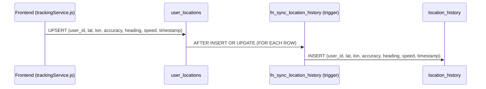
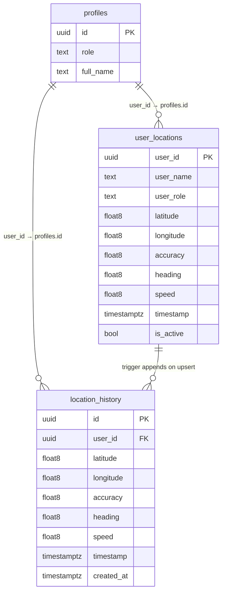

# Design Document: GPS Tracking — Database Layer

## Overview

The GPS tracking feature is already fully implemented on the frontend. This design covers the missing database layer: the `location_history` table, the `fn_sync_location_history` trigger function, and all RLS policies for both `user_locations` and `location_history`.

The deliverable is a single idempotent SQL migration file executable in the Supabase SQL editor. No frontend changes are required.

### Key Design Decisions

- **Trigger-based history**: The frontend upserts only to `user_locations` (one row per worker). The trigger automatically appends every GPS fix to `location_history`, keeping the frontend simple and ensuring no fix is ever missed.
- **SECURITY DEFINER trigger**: The trigger function runs with the privileges of its definer (a superuser/postgres role), bypassing RLS on `location_history`. This means end users never need a direct INSERT policy on `location_history` — the trigger handles all writes.
- **Idempotent migration**: All DDL uses `IF NOT EXISTS` / `CREATE OR REPLACE` / `DROP … IF EXISTS` guards so the file can be re-run safely against an existing database.
- **Role-based RLS via profiles join**: All policies resolve the current user's role by querying `public.profiles` with `auth.uid()`, consistent with the existing migration conventions in this project.

---

## Architecture





---

## Components and Interfaces

### 1. `location_history` Table

An append-only log of every GPS fix. One row is written per upsert to `user_locations`.

| Column | Type | Constraints |
|---|---|---|
| `id` | `uuid` | PK, default `gen_random_uuid()` |
| `user_id` | `uuid` | NOT NULL, FK → `profiles(id)` |
| `latitude` | `double precision` | NOT NULL |
| `longitude` | `double precision` | NOT NULL |
| `accuracy` | `double precision` | nullable |
| `heading` | `double precision` | nullable |
| `speed` | `double precision` | nullable |
| `timestamp` | `timestamptz` | NOT NULL |
| `created_at` | `timestamptz` | default `now()` |

Index: `(user_id, timestamp DESC)` — supports the `fetchUserLocationHistory` query pattern used by `useUserRoute`.

### 2. `fn_sync_location_history` Trigger Function

A `SECURITY DEFINER` PL/pgSQL function that fires `AFTER INSERT OR UPDATE FOR EACH ROW` on `user_locations`. It copies `NEW.user_id`, `NEW.latitude`, `NEW.longitude`, `NEW.accuracy`, `NEW.heading`, `NEW.speed`, and `NEW.timestamp` into `location_history`.

Using `SECURITY DEFINER` means the function executes with the privileges of its owner (typically `postgres`), bypassing RLS on `location_history`. This is the correct pattern for trigger-based audit tables in Supabase.

### 3. RLS Policies

#### `user_locations`

| Policy | Operation | Role | Condition |
|---|---|---|---|
| Workers insert own row | INSERT | authenticated | `user_id = auth.uid()` AND role is worker |
| Workers update own row | UPDATE | authenticated | `user_id = auth.uid()` AND role is worker |
| Viewers read all | SELECT | authenticated | role is viewer |
| Workers read own row | SELECT | authenticated | `user_id = auth.uid()` AND role is worker |

#### `location_history`

| Policy | Operation | Role | Condition |
|---|---|---|---|
| Viewers read all | SELECT | authenticated | role is viewer |
| Workers read own rows | SELECT | authenticated | `user_id = auth.uid()` AND role is worker |

No direct INSERT policy for end users — all inserts come from the `SECURITY DEFINER` trigger.

**Worker roles**: `sanitation_worker`, `operator`  
**Viewer roles**: `admin`, `district_officer`, `supervisor`

---

## Data Models

### Role Classification (used in all RLS policies)

```sql
-- Worker check
EXISTS (
  SELECT 1 FROM public.profiles
  WHERE id = auth.uid()
    AND role IN ('sanitation_worker', 'operator')
)

-- Viewer check
EXISTS (
  SELECT 1 FROM public.profiles
  WHERE id = auth.uid()
    AND role IN ('admin', 'district_officer', 'supervisor')
)
```

### GPS Fix Record (written by trigger)

```sql
INSERT INTO public.location_history (
  user_id, latitude, longitude, accuracy, heading, speed, timestamp
) VALUES (
  NEW.user_id, NEW.latitude, NEW.longitude,
  NEW.accuracy, NEW.heading, NEW.speed, NEW.timestamp
);
```

---

## Correctness Properties

*A property is a characteristic or behavior that should hold true across all valid executions of a system — essentially, a formal statement about what the system should do. Properties serve as the bridge between human-readable specifications and machine-verifiable correctness guarantees.*

### Property 1: Trigger sync on insert and update

*For any* valid GPS fix record (varying user_id, latitude, longitude, accuracy, heading, speed, timestamp), inserting a new row into `user_locations` OR updating an existing row SHALL result in exactly one new row being appended to `location_history` with field values matching the inserted/updated `user_locations` row.

**Validates: Requirements 2.2, 2.3, 2.5**

### Property 2: Workers can only write their own row

*For any* authenticated user with role `sanitation_worker` or `operator`, an INSERT or UPDATE on `user_locations` SHALL succeed if and only if the `user_id` column equals `auth.uid()`. Attempts to write a row with a different `user_id` SHALL be rejected by RLS.

**Validates: Requirements 3.2, 3.3**

### Property 3: Viewers can read all rows on both tables

*For any* authenticated user with role `admin`, `district_officer`, or `supervisor`, a SELECT on `user_locations` or `location_history` SHALL return all rows regardless of `user_id`.

**Validates: Requirements 3.4, 4.2**

### Property 4: Workers can only read their own rows on both tables

*For any* authenticated user with role `sanitation_worker` or `operator`, a SELECT on `user_locations` or `location_history` SHALL return only rows where `user_id` equals `auth.uid()`. Rows belonging to other users SHALL be invisible.

**Validates: Requirements 3.5, 4.3**

### Property 5: Migration idempotency

*For any* number of sequential executions of the migration file against the same database (N ≥ 2), each execution SHALL complete without error, and existing data in `location_history` SHALL be preserved after each re-run.

**Validates: Requirements 5.2, 5.5, 5.6**

---

## Error Handling

- **RLS deny-by-default**: PostgreSQL denies access when no policy matches. If a policy's subquery (the `profiles` join) fails due to a database error, access is denied — this is PostgreSQL's built-in fail-closed behavior (Requirement 4.7).
- **Trigger errors**: If `fn_sync_location_history` raises an exception, the parent `user_locations` upsert is rolled back. The frontend's `push()` function in `trackingService.js` already catches and logs these errors via the `onError` callback.
- **Null GPS fields**: `accuracy`, `heading`, and `speed` are nullable in both tables. The trigger copies them as-is, so `NULL` values from the GPS API are preserved correctly.
- **Idempotency guards**: `DROP POLICY IF EXISTS` before each `CREATE POLICY` prevents "policy already exists" errors on re-run. `CREATE TABLE IF NOT EXISTS` and `CREATE INDEX IF NOT EXISTS` prevent duplicate object errors.

---

## Testing Strategy

This feature is a pure database migration — no application logic, no pure functions, no parsers or serializers. The correctness properties above are best validated through database integration tests rather than unit tests.

### Property-Based Tests (pgTAP or equivalent)

Each property maps to a test that generates varied inputs and asserts the invariant holds:

- **Property 1** — Insert N random GPS fix rows into `user_locations` (varying all fields including nulls for optional fields), verify `location_history` gains exactly N matching rows. Then update M of those rows with new coordinates, verify M additional rows appear in `location_history`.
  - Tag: `Feature: gps-tracking, Property 1: trigger sync on insert and update`
  - Minimum iterations: 100

- **Property 2** — For random worker-role users, attempt INSERT/UPDATE with own `user_id` (should succeed) and with a different `user_id` (should be rejected with RLS error). Test both `sanitation_worker` and `operator` roles.
  - Tag: `Feature: gps-tracking, Property 2: workers can only write their own row`
  - Minimum iterations: 100

- **Property 3** — Insert rows for N random worker users, then SELECT as each viewer role (`admin`, `district_officer`, `supervisor`), verify row count equals N.
  - Tag: `Feature: gps-tracking, Property 3: viewers can read all rows`
  - Minimum iterations: 100

- **Property 4** — Insert rows for N random worker users, then SELECT as each worker, verify only their own rows are returned.
  - Tag: `Feature: gps-tracking, Property 4: workers can only read their own rows`
  - Minimum iterations: 100

- **Property 5** — Execute the migration file twice against a test database with pre-existing data, verify no errors and row counts are unchanged.
  - Tag: `Feature: gps-tracking, Property 5: migration idempotency`
  - Minimum iterations: 2 (deterministic)

### Smoke Tests (single execution)

- Verify `location_history` table exists with all required columns and correct types
- Verify FK constraint `location_history.user_id → profiles.id` exists
- Verify composite index `(user_id, timestamp DESC)` exists
- Verify RLS is enabled on both `user_locations` and `location_history`
- Verify trigger `fn_sync_location_history` exists and is `AFTER INSERT OR UPDATE FOR EACH ROW`
- Verify no direct INSERT policy exists for authenticated users on `location_history`

### Manual Verification

After applying the migration in the Supabase SQL editor:
1. Start GPS tracking as a worker user — confirm rows appear in both `user_locations` and `location_history`
2. Open the map as a viewer — confirm all active workers are visible
3. Open the map as a worker — confirm only own location is visible
4. Re-run the migration — confirm no errors and existing history rows are intact
