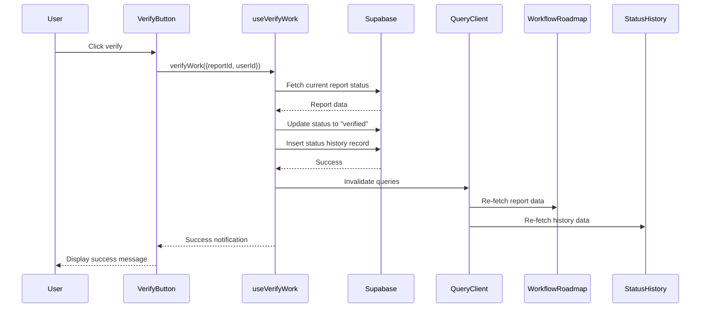

# Design Document

## Overview

The work verification workflow feature adds a verification step to the existing sanitation work lifecycle. When a sanitation worker marks work as complete (status: "disposed"), authorized users (admin, district_officer, supervisor) can verify the work quality and close the report (status: "verified"). This feature integrates seamlessly with the existing workflow components and follows established patterns for React hooks, Supabase data access, and permission checking.

## Architecture

The feature follows the existing application architecture:

1. **Presentation Layer**: React components integrated into the report detail page
2. **Business Logic Layer**: Custom React hook (`useVerifyWork`) encapsulating verification logic
3. **Data Access Layer**: Direct Supabase client calls for database operations
4. **Permission Layer**: Integration with existing RBAC system using `useHasPermission` hook

### Component Hierarchy

```
ReportDetailPage
├── WorkflowRoadmap (existing - displays verification status)
├── StatusHistory (existing - displays verification history)
└── VerifyWorkButton (new - triggers verification action)
```

### Data Flow



## Components and Interfaces

### 1. VerifyWorkButton Component

**Purpose**: Renders a button that triggers work verification for disposed reports.

**Props**:
```typescript
interface VerifyWorkButtonProps {
  reportId: string;
  reportStatus: string;
  userId: string;
}
```

**Behavior**:
- Checks if user has `REPORTS.CHANGE_STATUS` permission using `useHasPermission`
- Only renders when report status is "disposed" and user is authorized
- Displays loading state during verification
- Triggers verification via `useVerifyWork` hook
- Styled consistently with existing action buttons (emerald color scheme)

**Location**: `/components/reports/detail/VerifyWorkButton.js`

### 2. useVerifyWork Hook

**Purpose**: Encapsulates verification business logic and data operations.

**Interface**:
```typescript
function useVerifyWork(): {
  verifyWork: (params: { reportId: string; userId: string }) => Promise<void>;
  isLoading: boolean;
  error: Error | null;
}
```

**Implementation Pattern**: Follows the same pattern as `useCompleteWork` and `useStartWork`:
- Uses `@tanstack/react-query` `useMutation` for state management
- Performs validation before database updates
- Updates report status and creates history record
- Invalidates relevant queries on success
- Displays toast notifications for success/error

**Location**: `/hooks/useVerifyWork.js`

### 3. Integration Points

**WorkflowRoadmap Component** (existing):
- Already supports "verified" status in `STAGES` array
- Already displays verification timestamp from status history
- No modifications needed - will automatically reflect verified status

**StatusHistory Component** (existing):
- Already displays all status changes including verification
- No modifications needed - will automatically show verification entry

**ReportDetailPage** (existing):
- Add `<VerifyWorkButton>` component in appropriate location
- Pass required props: `reportId`, `reportStatus`, `userId`

## Data Models

### Database Schema (Existing - No Changes)

**sanitation_reports table**:
```sql
- id: uuid (primary key)
- status: text (values: 'pending', 'assigned', 'in_progress', 'disposed', 'verified', 'cancelled')
- updated_at: timestamp
- assigned_to: uuid (foreign key to profiles)
- ... (other fields)
```

**report_status_history table**:
```sql
- id: uuid (primary key)
- report_id: uuid (foreign key to sanitation_reports)
- old_status: text
- new_status: text
- changed_by: uuid (foreign key to profiles)
- changed_at: timestamp (default: now())
- notes: text
```

### Data Validation

**Pre-verification checks**:
1. Report exists (query returns non-null)
2. Current status is "disposed" (status === 'disposed')
3. User has permission (checked via `useHasPermission(REPORTS.CHANGE_STATUS)`)

**Post-verification state**:
1. Report status is "verified"
2. Report updated_at is current timestamp
3. Status history contains verification record with correct old_status, new_status, changed_by, and notes

## Correctness Properties

*A property is a characteristic or behavior that should hold true across all valid executions of a system—essentially, a formal statement about what the system should do. Properties serve as the bridge between human-readable specifications and machine-verifiable correctness guarantees.*

### Property 1: Status Transition Validity

*For any* report with status "disposed", when verification is executed by an authorized user, the resulting report status SHALL be "verified" and the status history SHALL contain exactly one new entry with old_status "disposed" and new_status "verified".

**Validates: Requirements 2.1, 2.2, 3.1, 3.2**

### Property 2: Permission Enforcement

*For any* verification attempt, if the user does not have role "admin", "district_officer", or "supervisor", the verification SHALL fail and the report status SHALL remain unchanged.

**Validates: Requirements 4.1, 4.2, 4.3, 4.4, 4.5**

### Property 3: Idempotent Verification Prevention

*For any* report with status "verified", attempting verification SHALL fail with an appropriate error message and the report status SHALL remain "verified".

**Validates: Requirements 6.2, 6.4**

### Property 4: Status History Completeness

*For any* successful verification, the created status history record SHALL contain all required fields: report_id, old_status ("disposed"), new_status ("verified"), changed_by (user ID), changed_at (timestamp), and notes.

**Validates: Requirements 3.1, 3.2, 3.3, 3.4**

### Property 5: UI State Consistency

*For any* successful verification, all cached queries related to the report SHALL be invalidated, ensuring the UI reflects the updated "verified" status across all components.

**Validates: Requirements 5.3, 5.4, 5.5, 6.5**

## Error Handling

### Error Scenarios

1. **Report Not Found**
   - Condition: Report ID does not exist in database
   - Response: Error message "Report not found"
   - UI: Toast notification with error message
   - Status: No change

2. **Invalid Status**
   - Condition: Report status is not "disposed"
   - Response: Error message "Report cannot be verified in current status"
   - UI: Toast notification with error message
   - Status: No change

3. **Permission Denied**
   - Condition: User lacks REPORTS.CHANGE_STATUS permission
   - Response: Error message "You do not have permission to verify reports"
   - UI: Button not rendered (preventive) or toast notification (defensive)
   - Status: No change

4. **Database Update Failure**
   - Condition: Supabase update operation fails
   - Response: Error message from Supabase or generic "Failed to verify report"
   - UI: Toast notification with error message
   - Status: No change (transaction rollback)

5. **History Record Failure**
   - Condition: Status history insert fails
   - Response: Log error to console, continue (non-critical)
   - UI: Success notification (report status updated)
   - Status: Changed to "verified" (history is audit trail, not critical path)

### Error Recovery

- All errors display user-friendly toast notifications
- Button re-enables after error to allow retry
- No partial state updates (report status and history are separate operations, but history failure is non-critical)
- Query invalidation only occurs on successful verification

## Testing Strategy

### Unit Tests

**VerifyWorkButton Component**:
- Renders button when status is "disposed" and user has permission
- Does not render when status is not "disposed"
- Does not render when user lacks permission
- Displays loading state during verification
- Calls `verifyWork` with correct parameters on click
- Disables button during loading

**useVerifyWork Hook**:
- Validates report exists before updating
- Validates current status is "disposed"
- Updates report status to "verified"
- Creates status history record with correct fields
- Invalidates correct queries on success
- Displays success toast on success
- Displays error toast on failure
- Handles permission errors appropriately

### Integration Tests

**End-to-End Verification Flow**:
1. Create a report with status "disposed"
2. Authenticate as supervisor
3. Navigate to report detail page
4. Click verify button
5. Verify report status changes to "verified"
6. Verify status history contains verification entry
7. Verify WorkflowRoadmap displays "verified" status
8. Verify StatusHistory displays verification entry

**Permission Enforcement**:
1. Create a report with status "disposed"
2. Authenticate as sanitation_worker (unauthorized)
3. Navigate to report detail page
4. Verify button is not rendered
5. Attempt direct API call to verify
6. Verify request fails with permission error

### Property-Based Tests

Property-based testing is not applicable for this feature because:
- The feature involves UI interactions and external service calls (Supabase)
- Verification is a state transition with specific preconditions (status must be "disposed")
- The behavior is deterministic for given inputs (no complex input space to explore)
- Integration tests with 2-3 representative examples provide sufficient coverage

Instead, use:
- **Unit tests** for component rendering logic and hook behavior
- **Integration tests** for end-to-end verification flow
- **Manual testing** for UI/UX validation

### Test Data

**Test Reports**:
```javascript
const disposedReport = {
  id: 'test-report-1',
  status: 'disposed',
  assigned_to: 'worker-1',
  updated_at: '2024-01-01T00:00:00Z'
};

const verifiedReport = {
  id: 'test-report-2',
  status: 'verified',
  assigned_to: 'worker-1',
  updated_at: '2024-01-01T00:00:00Z'
};

const pendingReport = {
  id: 'test-report-3',
  status: 'pending',
  assigned_to: null,
  updated_at: '2024-01-01T00:00:00Z'
};
```

**Test Users**:
```javascript
const supervisor = {
  id: 'user-1',
  role: 'supervisor',
  full_name: 'Test Supervisor'
};

const admin = {
  id: 'user-2',
  role: 'admin',
  full_name: 'Test Admin'
};

const worker = {
  id: 'user-3',
  role: 'sanitation_worker',
  full_name: 'Test Worker'
};
```

## Implementation Notes

### Styling Consistency

Follow existing button patterns:
- Use emerald color scheme for positive actions (matches "Start Work", "Complete Work")
- Use Lucide React icons (ShieldCheck icon for verification)
- Use consistent padding, border radius, and hover states
- Use toast notifications from `react-hot-toast` (already in use)

### Query Invalidation

Invalidate these queries on successful verification:
- `['report', reportId]` - Individual report data
- `['reports']` - Report list
- `['assignment-history']` - Assignment history (if applicable)

### Permission Check

Use existing permission system:
```javascript
import { useHasPermission } from '@/hooks/usePermissions';
import { REPORTS } from '@/lib/permissions';

const canVerify = useHasPermission(REPORTS.CHANGE_STATUS);
```

### Database Operations

Follow existing patterns from `useCompleteWork`:
1. Fetch current report to validate status
2. Update report status with error handling
3. Insert status history record (non-critical, log errors)
4. Return success/error to caller

### Component Placement

Add `VerifyWorkButton` in the report detail page:
- Position: Below WorkflowRoadmap or in QuickActions sidebar
- Visibility: Only when status is "disposed" and user has permission
- Layout: Full-width button with icon and text

## Future Enhancements

1. **Verification Comments**: Allow verifiers to add optional comments explaining verification decision
2. **Verification Photos**: Allow verifiers to upload photos confirming work completion
3. **Rejection Flow**: Add ability to reject verification and send back to "in_progress" with feedback
4. **Verification Metrics**: Track verification times and verifier performance
5. **Bulk Verification**: Allow verifying multiple reports at once from a list view
6. **Verification Reminders**: Notify supervisors when reports have been disposed for extended periods
